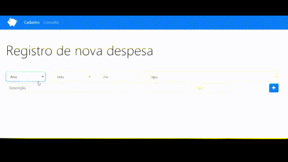

### About the Personal Budget Application

This project is a **Personal Budget Management System**, designed to help users organize and track their expenses. Built with **HTML**, **Bootstrap**, and **JavaScript**, it provides an intuitive interface to record and manage financial data efficiently.

---

## Objectives

The primary goals of this application are:
1. **Expense Tracking**: Record daily expenses categorized by type.
2. **Organization**: Enable users to structure their financial data with fields like date, type, description, and value.
3. **Accessibility**: Provide a user-friendly, responsive design for easy use on any device.

---

## Features

### **Main Components**
1. **Registration Page**:
   - Users can record a new expense by providing:
     - **Date**: Year, month, and day.
     - **Type**: Categories like food, education, leisure, health, and transport.
     - **Description**: Details of the expense.
     - **Value**: The amount spent.
   - A button is available to save the expense (`cadastrarDespesa()`).

2. **Modal Feedback System**:
   - After adding an expense, a modal is displayed to provide feedback (success or error messages).

3. **Navbar**:
   - Links for navigation between the registration page and a **consultation page** (e.g., `index.html` for expense registration, `consulta.html` for reviewing expenses).

### **Responsive Design**
- The layout is crafted with **Bootstrap 4**, ensuring compatibility across different screen sizes.

---

## Technical Details

### **Frontend**
- **Bootstrap 4**: Used for styling, responsive layout, and pre-built UI components.
- **Font Awesome**: Icons enhance the visual appeal (e.g., the "plus" icon for adding an expense).

### **Form Fields**
- Year (`Ano`), month (`Mês`), and day (`Dia`) dropdowns/input fields for the expense date.
- Dropdown menu for selecting an **expense type**.
- Text inputs for **description** and **value**.

### **Modal Implementation**
- The modal is dynamically updated with titles and content depending on the operation's success or failure.

---

## Use Cases

1. **Daily Expense Management**:
   - Quickly log expenses with detailed categorization.

2. **Financial Insights**:
   - Organize expenses by categories to analyze spending patterns.

3. **Education Tool**:
   - Demonstrates how web technologies (HTML, Bootstrap, JavaScript) can create a functional and interactive application.

---

## Future Enhancements

1. **Expense Consultation**:
   - Implement the `consulta.html` page to filter and display stored expenses.

2. **Persistent Data**:
   - Store data using **localStorage**, **indexedDB**, or integrate a backend.

3. **Analytics Dashboard**:
   - Visualize spending trends using charts and graphs.

4. **Multi-user Support**:
   - Enable login functionality for individual budgeting.

---

This simple yet powerful tool is a great example of how to blend technology and user-centric design to create practical applications for daily use.